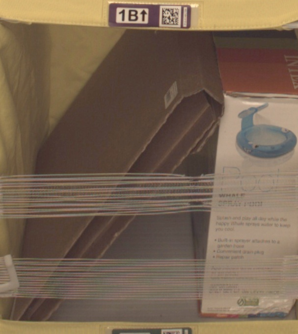
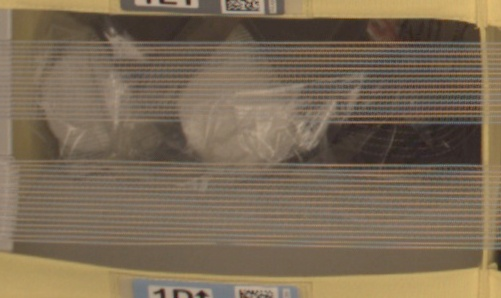
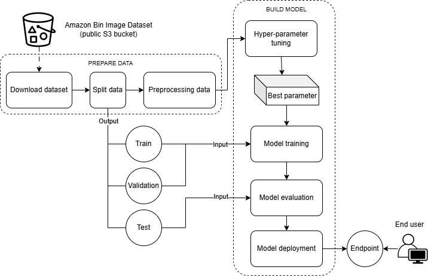

# Machine Learning Engineer Nanodegree
## Capstone Project Proposal
Marcin Tomkiewicz
14th January, 2025

## Proposal

### Domain Background

In the logistics industry, effective inventory management and precise order fulfillment are essential for ensuring operational efficiency and customer satisfaction. Many warehouse activities today still rely heavily on human labor. For large-scale businesses, quickly increasing the workforce can lead to significant costs and potential challenges in staff management. As e-commerce continues to grow rapidly and supply chains become more complex, the demand for advanced technological solutions to optimize these processes has increased. One widely adopted solution is the use of technologies, such as machine learning, to automate and improve inventory tracking, item recognition, and sorting tasks.

### Problem Statement

In Amazon's warehouse operations, robots are used to move items as part of their daily processes. These items are transported in bins, each containing multiple objects. To ensure that customer orders are fulfilled correctly, it’s crucial to verify that the right number of items are included in each delivery. Amazon's robotics, scanning equipment, and computer systems in fulfillment centers can track millions of items daily. However, an inventory system reliant solely on manual checks is highly labor-intensive.

This project aims to leverage the "Amazon Bin Image Dataset" to develop machine learning models that can accurately recognize and count the objects in each bin. The dataset includes a wide range of images captured in warehouse settings, showing various items within bins. By implementing advanced image recognition and classification algorithms, the objective is to build a robust system that can reliably identify products, monitor inventory levels, and streamline order picking processes. Additionally, the resulting model seeks to reduce manual labor, minimize errors, enhance efficiency, and, most importantly, simulate a complete machine learning pipeline for logistics data processing.

### Datasets and Inputs

To carry out this project, I will utilize the [Amazon Bin Image Dataset](https://registry.opendata.aws/amazon-bin-imagery/)

This dataset consists of 500,000 images of bins, each containing one or more items. Along with each image, there is a metadata file that provides details such as the number of objects, their dimensions, and the type of items. 

Sample of the images:

<div align="center">
    
    
    
</div>

Images are located in the bin-images directory, and metadata for each image is located in the metadata directory. Images and their associated metadata share simple numerical unique identifiers. For example:

Image:


JSON file:

```
{
    "BIN_FCSKU_DATA": {
        "B000A8C5QE": {
            "asin": "B000A8C5QE",
            "height": {
                "unit": "IN",
                "value": 4.200000000000001
            },
            "length": {
                "unit": "IN",
                "value": 4.7
            },
            "name": "MSR PocketRocket Stove",
            "quantity": 1,
            "weight": {
                "unit": "pounds",
                "value": 0.45
            },
            "width": {
                "unit": "IN",
                "value": 4.4
            }
        },
        "B0064LIWVS": {
            "asin": "B0064LIWVS",
            "height": {
                "unit": "IN",
                "value": 1.2
            },
            "length": {
                "unit": "IN",
                "value": 5.799999999999999
            },
            "name": "Applied Nutrition Liquid Collagen Skin Revitalization, 10 Count 3.35 Fl Ounce",
            "quantity": 1,
            "weight": {
                "unit": "pounds",
                "value": 0.3499999999999999
            },
            "width": {
                "unit": "IN",
                "value": 4.7
            }
        }
    },
    "EXPECTED_QUANTITY": 2,
    "image_fname": "523.jpg"
}
```

### Solution Statement

The solution will focus on image recognition and classification area. The solution will consist of multiple stages but the main pillar will be a image classification model. For this purposes I will use a pre-trained Resnet50 deep learning model. The model will be additionally trained on the images from the dataset (train and validation sets). The raw images will be imputed to the model that should produce a list of probabilities for 5 labels for each bin.

A set of AWS tools will be used to perform all the steps mentioned in the project design section of this document.
Accuracy metric will be used to evaluate selected model and compare it to the benchmark one.

### Benchmark Model

The project's performance will be evaluated using accuracy, as this is a classification task. Our target is to achieve an accuracy greater than 55.67% on the validation set using deep learning models. This level was set in the publication [Amazon Bin Image Dataset(ABID) Challenge](https://github.com/silverbottlep/abid_challenge).

### Evaluation Metrics

In a classification problem, accuracy is typically used as the primary metric to evaluate the model's performance. However, there are other metrics that can help monitor the model's accuracy and identify anomalies in the dataset or final results. For example, we can also use the confusion matrix along with common metrics like precision, recall, F1-score, and the ROC/AUC curve.

### Project Design

The project will consists of below steps:
1. Download data from public S3
2. Split data into training, validation and test sets and upload the the folders to created S3 bucket
3. Perform data preprocessing
4. Train the initial model and then apply hyperparameter tuning to confirm the best setup
5. Use final setup to crate final version of the model
6. Evaluate the model based on test set and compare it to benchmark model
7. Deploy the model by creating an endpoint.
8. Create Lambda function for inference

Project scheme:



### Reference

- Dataset: [Amazon Bin Image Dataset](https://registry.opendata.aws/amazon-bin-imagery/)
- Usage examples:
    - [Amazon Inventory Reconciliation using AI](https://github.com/pablo-tech/Image-Inventory-Reconciliation-with-SVM-and-CNN)
    - [Amazon Bin Image Dataset(ABID) Challenge](https://github.com/silverbottlep/abid_challenge)