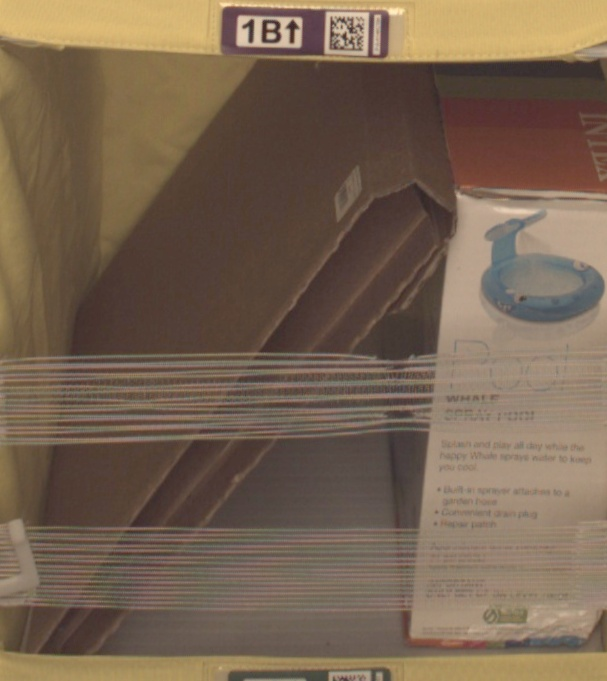

# Udacity AWS Machine Learning Engineer Nanodegree

## Domain Background

In the logistics industry, effective inventory management and precise order fulfillment are essential for ensuring operational efficiency and customer satisfaction. Many warehouse activities today still rely heavily on human labor. For large-scale businesses, quickly increasing the workforce can lead to significant costs and potential challenges in staff management. As e-commerce continues to grow rapidly and supply chains become more complex, the demand for advanced technological solutions to optimize these processes has increased. One widely adopted solution is the use of technologies, such as machine learning, to automate and improve inventory tracking, item recognition, and sorting tasks.

## Problem Statement

In Amazon's warehouse operations, robots are used to move items as part of their daily processes. These items are transported in bins, each containing multiple objects. To ensure that customer orders are fulfilled correctly, it’s crucial to verify that the right number of items are included in each delivery. Amazon's robotics, scanning equipment, and computer systems in fulfillment centers can track millions of items daily. However, an inventory system reliant solely on manual checks is highly labor-intensive.

This project aims to leverage the "Amazon Bin Image Dataset" to develop machine learning models that can accurately recognize and count the objects in each bin. The dataset includes a wide range of images captured in warehouse settings, showing various items within bins. By implementing advanced image recognition and classification algorithms, the objective is to build a robust system that can reliably identify products, monitor inventory levels, and streamline order picking processes. Additionally, the resulting model seeks to reduce manual labor, minimize errors, enhance efficiency, and, most importantly, simulate a complete machine learning pipeline for logistics data processing.

## Datasets and Inputs

To carry out this project, I will utilize the [Amazon Bin Image Dataset](https://registry.opendata.aws/amazon-bin-imagery/)

This dataset consists of 500,000 images of bins, each containing one or more items. Along with each image, there is a metadata file that provides details such as the number of objects, their dimensions, and the type of items. 

Sample of the images:

<div align="center">
    
    
    
</div>

Images are located in the bin-images directory, and metadata for each image is located in the metadata directory. Images and their associated metadata share simple numerical unique identifiers. For example:

Image:


JSON file:

```
{
    "BIN_FCSKU_DATA": {
        "B000A8C5QE": {
            "asin": "B000A8C5QE",
            "height": {
                "unit": "IN",
                "value": 4.200000000000001
            },
            "length": {
                "unit": "IN",
                "value": 4.7
            },
            "name": "MSR PocketRocket Stove",
            "quantity": 1,
            "weight": {
                "unit": "pounds",
                "value": 0.45
            },
            "width": {
                "unit": "IN",
                "value": 4.4
            }
        },
        "B0064LIWVS": {
            "asin": "B0064LIWVS",
            "height": {
                "unit": "IN",
                "value": 1.2
            },
            "length": {
                "unit": "IN",
                "value": 5.799999999999999
            },
            "name": "Applied Nutrition Liquid Collagen Skin Revitalization, 10 Count 3.35 Fl Ounce",
            "quantity": 1,
            "weight": {
                "unit": "pounds",
                "value": 0.3499999999999999
            },
            "width": {
                "unit": "IN",
                "value": 4.7
            }
        }
    },
    "EXPECTED_QUANTITY": 2,
    "image_fname": "523.jpg"
}
```
Images are assigned to 5 label buckets. After checking the distribution of the data we can see that there is a slight imbalance of the labels


### Data pre-processing

The images are downloaded from URL. All of them are converted to image bytes. To make sure that all of them have same size an image resizing is done by data loaders to 224x224 pixels using PyTorch transformers. The data is divided into training, validation and testing sets for further model training.

## Solution Statement

The solution will focus on image recognition and classification area. The solution will consist of multiple stages but the main pillar will be a image classification model. For this purposes I will use a pre-trained Resnet50 deep learning model. The model will be additionally trained on the images from the dataset (train and validation sets). The raw images will be imputed to the model that should produce a list of probabilities for 5 labels for each bin.

A set of AWS tools will be used to perform all the steps mentioned in the project design section of this document.
Accuracy metric will be used to evaluate selected model and compare it to the benchmark one.

## Access
Upload the data to an S3 bucket through the AWS Gateway so that SageMaker has access to the data. 

### Structure of the project
The project contain several files required for model creation, training and deployment:
* `Proposal folder` - contains the project proposal file
* `ProfilerReport` - contains the profiler report created by the estimator code
* `train.py` - used for original model creation with set of hyperparameters to tune (afterwards extended by the debugging and profiling code)
* `inference.py` - used for code deployment
* `sagemaker.ipynb` - code with overall project configuration and step by step setup
* `lambdafunction.py` - code implemented in AWS lambda function
* `Readme.md` - summary file

## Project Design

The project will consists of below steps:
1. Download data from public S3
2. Split data into training, validation and test sets and upload the the folders to created S3 bucket
3. Perform data preprocessing
4. Train the initial model and then apply hyperparameter tuning to confirm the best setup
5. Use final setup to crate final version of the model
6. Evaluate the model based on test set and compare it to benchmark model
7. Deploy the model by creating an endpoint.
8. Create Lambda function for inference

Project scheme:


## Model Training and Hyper-parameters tunning

A pretrained Resnet50 model was used for this project.

I selected 3 hyperparameters to find the best configurations. These where:
* `Learning Rate in range ContinuousParameter(0.001, 0.1)` - it usually has small values based on a log scale. It affects the peed of training and if appropriate does not cause the learning process to diverge.
* `Batch-size in range CategoricalParameter([32, 64, 128])` - it affects the speed of training and accuracy. With higher batch size we get more stable results but the speed of training deteriorates
* `Number of Epochs in range IntegerParameter(1, 3)` - it represents the number of trainings done with the selected model, high number can cause overfitting

The accuracy of the benchmark model chosen is 56% ([Amazon Bin Image Dataset(ABID) Challenge](https://github.com/silverbottlep/abid_challenge). My tunned model did not achieve such high results which means that as follow up steps we would have to focus more on data preprocessing and maybe extend the number of parameters for tunning (or existing parameter ranges) in the model training.


**Insights from the plot**
- The training loss initially increases within small number of steps but then significantly decreases with the higher number of steps.
- The validation loss seems to be quite stable but quite noisy

## Debugging and Profiling
- **Debugging** captures the tensor values as they go through training and evaluation phase of the process
- **Profiling** captures model metrics like CPU and GPU utilization, outliers, bottlenecks and other statistics

### Steps done to apply model debugging and profiling
- Install and import the smdebug module. 
- Setup hooks inside the training script (train inside training function and eval inside validation and testing) 
- Register the hook in the model to get the tensors and track the loss function
- Created debugger and profiler configurations in Jupyter Notebook. 
- Run the model with the created configurations ad retrieve final reports

```
rules = [ 
    Rule.sagemaker(rule_configs.loss_not_decreasing()),
    ProfilerRule.sagemaker(rule_configs.ProfilerReport())
]

profiler_config = ProfilerConfig(
    system_monitor_interval_millis=500, framework_profile_params=FrameworkProfile(num_steps=10)
)

collection_configs=[
    CollectionConfig(
        name="weights",
        parameters={
            "train.save_interval": "5",
            "eval.save_interval": "1"
        }
    ),
    CollectionConfig(
        name="gradients",
        parameters={
            "train.save_interval": "5",
            "eval.save_interval": "1"
        }
    ),
    CollectionConfig(
        name="biases",
        parameters={
            "train.save_interval": "5",
            "eval.save_interval": "1"
        }
    ),
    CollectionConfig(
        name="CrossEntopyLoss_output_0", 
        parameters={
            "include_regex": "CrossEntropyLoss_output_0",
            "train.save_interval": "1",
            "eval.save_interval": "1"
        }
    )
]

debugger_config = DebuggerHookConfig(
    hook_parameters={
        "train.save_interval": "5",
        "eval.save_interval": "1"
    },
    collection_configs=collection_configs
)

estimator_deb = PyTorch(
    entry_point="train.py",
    role=role,
    instance_count=1,
    instance_type="ml.c5.2xlarge",
    framework_version="1.8",
    py_version="py36",
    hyperparameters=hyperparameters,
    profiler_config=profiler_config,
    debugger_hook_config=debugger_config,
    rules=rules,
)
```

* **Debugger**: Revealed PoorWeightInitialization issue.
* **Profiler** Revealed existence of several outliers in the dataset

## Model Deployment

- The deployed model is a ResNet50 pre-trained model with the fine-tuned parameters
- Model takes and image of size (3, 224, 224) as an input and outputs 5 values representing the label folders
- The model was fine-tuned for 3 epochs using a batch size of 64 and learning rate ~0.008.
- The Sagemaker estimator model is deployed to a SageMaker endpoint on machine of instance-type: ml.m5.xlarge using inference.py

```
model = PyTorchModel(
    model_data=model_data,
    role=role,
    entry_point="deploy_model.py",
    py_version='py36',
    framework_version="1.8"
)

predictor = model.deploy(
    initial_instance_count=1, 
    instance_type="ml.m5.xlarge"
)
```

This deployment resulted in error when I tried to test the responses from the endpoint


I found the proposed solution on the [Udacity Knowledge](https://knowledge.udacity.com/questions/999383) page. The solution was to prepare the estimator based on the different frame work version. I applied the solution and test it with successful result

```
estimator = PyTorch(
    entry_point="train.py",
    role=role,
    instance_count=1,
    instance_type='ml.m5.xlarge',
    framework_version="1.4.0",
    py_version="py3",
    hyperparameters=hyperparameters,
    profiler_config=profiler_config,
    debugger_hook_config=debugger_config,
    rules=rules,
)
inputs = "s3://mle-project-bucket/dataset/bin-images/"
estimator.fit({"training": inputs}, wait=True)
)

model_data = "s3://sagemaker-us-east-1-920813457542/pytorch-training-2025-01-24-11-02-02-816/output/model.tar.gz"

pytorch_model = PyTorchModel(model_data=model_data, role=role, entry_point='infernce.py',py_version='py3',
                             framework_version='1.4',
                             predictor_cls=ImagePredictor)
predictor = pytorch_model.deploy(initial_instance_count=1, instance_type='ml.m5.large')
```

## Lambda function

- **Setting up AWS Lambda**
Next step was to setup the AWS lambda function that would use one of the model endpoints created above. Lambda function enables access to our model through inferences that allows connecting by other tools.

The new endpoint name was added to the lambda function setup as per the code below. Before running a successful test a permission setup for lambda had to be updated.

```
import base64
import logging
import json
import boto3
#import numpy
logger = logging.getLogger(__name__)
logger.setLevel(logging.DEBUG)

print('Loading Lambda function')

runtime=boto3.Session().client('sagemaker-runtime')
endpoint_Name='pytorch-inference-2025-01-24-13-36-23-226'

def lambda_handler(event, context):

    #x=event['content']
    #aa=x.encode('ascii')
    #bs=base64.b64decode(aa)
    print('Context:::',context)
    print('EventType::',type(event))
    bs=event
    runtime=boto3.Session().client('sagemaker-runtime')
    
    response=runtime.invoke_endpoint(EndpointName=endpoint_Name,
                                    ContentType="application/json",
                                    Accept='application/json',
                                    #Body=bytearray(x)
                                    Body=json.dumps(bs))
    
    result=response['Body'].read().decode('utf-8')
    sss=json.loads(result)
    
    return {
        'statusCode': 200,
        'headers' : { 'Content-Type' : 'text/plain', 'Access-Control-Allow-Origin' : '*' },
        'type-result':str(type(result)),
        'COntent-Type-In':str(context),
        'body' : json.dumps(sss)
        #'updated_result':str(updated_result)

        }
```

- **Adding SageMaker permission to Lambda Functions**

For successful implementation Lambda function needs proper permissions setup which is dome through IAM settings. As Lambda will use SageMaker model therefore I decided to add below policies:


1. Amazon Lambda Full Access - for being able to execute and access functions. Deals with lambda specific operations.
2. Amazon SageMaker Full Access - for access SageMaker related services such as deployed endpoints.

- **Testing Lambda function**

After attaching required policies I did a test run based on provided test case. It was successful and the results are visible below:


## Cheaper training options

At the end I tried to run the model training code based on the Spot and multi-instance setup and comparing the costs

Normal instance training time:
-- Training seconds: 1881
-- Billable seconds: 1881

Spot instance training time:
-- Training seconds: 1921
-- Billable seconds: 714
-- Managed Spot Training savings: 62.8%

Multi-instance training time:
-- Training seconds: 5994
-- Billable seconds: 5994


After running the training jobs based on 3 above setups it looks like to most cost effective strategy in this case is using the spot instance. Spot Instances are a cost-effective choice if you can be flexible about when your applications run and if your applications can be interrupted. For example, Spot Instances are well-suited for data analysis, batch jobs, background processing, and optional tasks.

## Future steps and considerations to improve model performance

1. Rebalance Label data, include more data to have label 1 balance closer to the other buckets
2. More focus on hyper-parameters tunning, extend the ranges of chosen hyper-parameters and include other ones
3. Try different model to see if it has better performance them selected one
